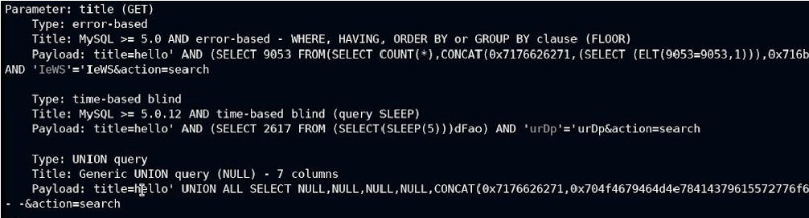
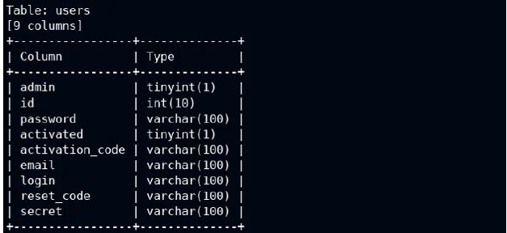
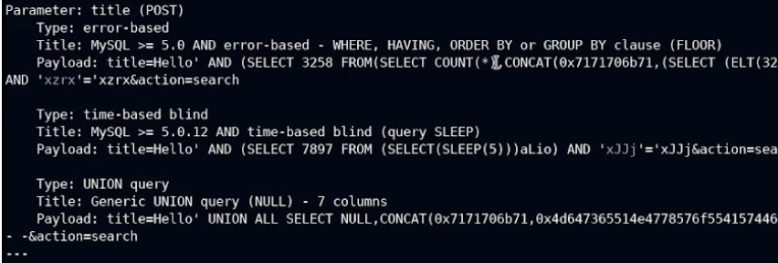

# WAPT-SQL-Injection-with-SQLMap
WAPT perform SQLi with sqlmap. 
I show only the important steps required to perform the attack, so, I didn’t explain everything. 
# Introduction of the tool
SQLmap is a tool that can automatically detect and exploit SQL injection vulnerabilities in web applications. SQL injection is a type of attack that allows an attacker to execute malicious SQL statements on a database server, which can result in data theft, data manipulation, or even complete takeover of the server.  SQLmap can perform various tasks, such as: 
- Fingerprinting the database management system (DBMS) and its version. 
- Enumerating the users, databases, tables, columns, and data stored in the database. 
- Dumping the data from the database or specific columns or rows. 
- Searching for specific data in the database, such as usernames, passwords, or credit card numbers. 
- Uploading or downloading files from the database server’s file system. 
- Executing arbitrary commands or scripts on the database server’s operating system. 
- Establishing an out-of-band connection with the attacker’s machine, which can be used for interactive shell, graphical user interface, or file transfer. 
- Escalating the privileges of the database process user using Metasploit’s Meterpreter. 
SQLmap is a command-line tool that can be used on any platform that supports Python. It has a powerful detection engine and a wide range of options and features that make it a versatile and effective tool for penetration testing and vulnerability assessment.

## SQLi with SQLmap
We perform the attack on bWAPP.  
### Goal: Get some payloads to perform SQLi (GET/Search).  
Use nmap to scan the network and identify the ports that are running the http and mysql services. The ports must be OPEN. 
1) Start Burp Proxy in interception mode and active FoxyProxy from browser to capture the http request. 
2) In the page vulnerable to SQLi (GET/Search) write something in the form and click search to intercept the request and get the url with parameters.
3) Save somewhere the cookie of the request, we will use to attack with SQLmap. Save the url of the page (there are the parameters inside it, in our case it's title).
4) Perform the attack:<b> sqlmap -u "url" --cookie "cookie" -p title</b>   (title is the variable to attack). After the command u will have some payloads that u can inject in the form.
   
5) Send the request http into repeater and use the payloads as part of the title parameter to inject your malicious request.
You can decide to use curl or burp or others tools.
   
### Goal: Get informations of the DB's.  
1) Get a list of databases present on the database server:<b> sqlmap -u "url" --cookie "cookie" -p title --dbs</b>
2) Get a list of tables:<b> sqlmap -u "url" --cookie "cookie" p title -D "name_db_found" --tables</b>
3) Get the list of columns in the specific table of the specific database found:<b> sqlmap -u "url" --cookie "cookie" p title -D "name_db_found" --tables -T "name_table" --columns</b>
   
4) Use SQLmap to dump password and email for admin from the users table:<b> sqlmap -u "url" --cookie "cookie" -p title -D "name_db_found" -T users -C admin,password,email --dump</b>

### Goal: Get some payloads to perform SQLi (POST/Search).  
1) Start Burp Proxy in interception mode and active FoxyProxy from browser to capture the http request.
2) In the page vulnerable to SQLi (POST/Search) write something in the form and click search to intercept the request and get the url with parameters.
3) Save the request http Post and rename it as request
4) Perform the attack:<b>  sqlmap -r request -p title</b>. You receive some payloads to inject into the form.
   
5) Send the request http into repeater and use the payloads as part of the title parameter to inject your malicious request.
You can decide to use curl or burp or others tools. 

#Author
<b>Xiao Li Savio Feng</b>
